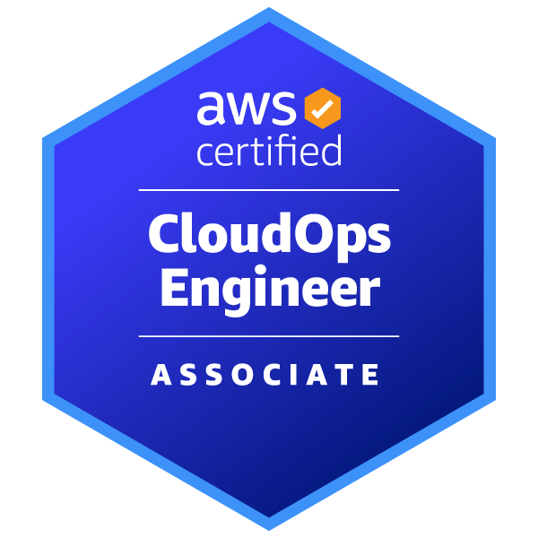
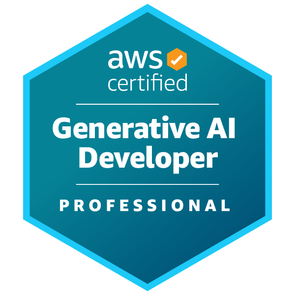
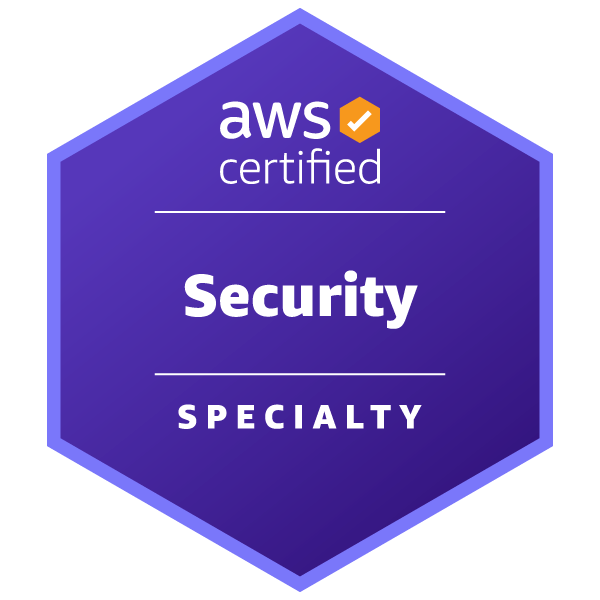
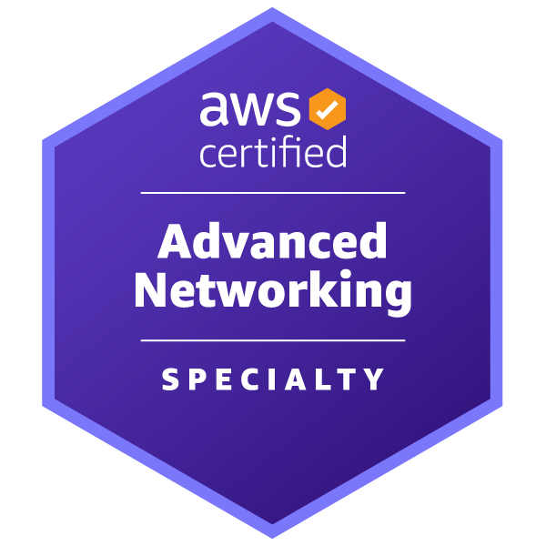

# r/AWSCertifications Wiki

Welcome to the **community-maintained knowledge base** for [r/AWSCertifications](https://reddit.com/r/AWSCertifications) — your one-stop resource for AWS certification exam guides, discounts, study tips, and community-curated content.

Before creating a post, please check whether your question is already answered here.

---

## Quick Links

-   :material-sign-direction: __Certification Pathways__
    ---
    20+ career pathways with recommended certs, skills, and timeline.
    [:octicons-arrow-right-24: Find your path](certification-pathways.md)

-   :material-ticket-percent: __Vouchers & Discounts__
    ---
    Active promotions, exam benefits, and money-saving tips.
    [:octicons-arrow-right-24: Explore](vouchers-discounts.md)

-   :material-certificate: __Exam Benefits__
    ---
    50% off your next exam, retake options, and partner programs.
    [:octicons-arrow-right-24: Learn more](exam-benefits.md)

-   :material-school: __Free Learning__
    ---
    Free courses, labs, and resources for every skill level.
    [:octicons-arrow-right-24: Start learning](free-learning.md)

-   :material-cloud: __AWS Programs__
    ---
    Cloud Institute, Community Builder, re/Start, and more.
    [:octicons-arrow-right-24: Explore programs](programs-similar-skills-to-jobs.md)

-   :material-badge-account: __Digital Badges__
    ---
    Earn AWS Knowledge Badges — free, fast, and shareable.
    [:octicons-arrow-right-24: Claim badges](digital-badges.md)

-   :material-tools: __Projects & Hands-on__
    ---
    Practice labs, sandboxes, and real-world project ideas.
    [:octicons-arrow-right-24: Get hands-on](projects-hands-on.md)

-   :material-help-circle: __FAQ__
    ---
    Exam results, practice scores, Tutorials Dojo, and more.
    [:octicons-arrow-right-24: Browse FAQ](faq.md)

---

## Featured Certifications

Choose your certification path based on your goals and experience level. Each guide includes exam details, study resources, practice exams, and community tips.

### Foundational

[{ loading=lazy } Cloud Practitioner (CLF-C02)](foundational/cloud-practitioner.md)

[{ loading=lazy } AI Practitioner (AIF-C01)](foundational/ai-practitioner.md)

### Associate

[{ loading=lazy } Solutions Architect (SAA-C03)](associate/solutions-architect.md)

[{ loading=lazy } Developer (DVA-C02)](associate/developer.md)

[{ loading=lazy } Data Engineer (DEA-C01)](associate/data-engineer.md)

[{ loading=lazy } ML Engineer (MLA-C01)](associate/machine-learning.md)

[{ loading=lazy } CloudOps (SOA-C02/03)](associate/cloudops.md)

### Professional

[{ loading=lazy } Solutions Architect Pro (SAP-C02)](professional/solutions-architect-pro.md)

[{ loading=lazy } DevOps Engineer Pro (DOP-C02)](professional/devops-engineer-pro.md)

[{ loading=lazy } GenAI Developer Pro (AIP-C01)](professional/genai-developer-pro.md)

### Specialty

[{ loading=lazy } Security (SCS-C02)](specialty/security.md)

[{ loading=lazy } Advanced Networking (ANS-C01)](specialty/advanced-networking.md)

---

## Wiki at a Glance

20+

Career Pathways

11

AWS Certifications

4

Certification Levels

Explore certification roadmaps for beginners, developers, architects, DevOps, AI/ML, security, networking, and many more.

[View all certification pathways →](certification-pathways.md)

---

## FAQ

View all FAQ topics on the [FAQ page](faq.md).

-   :material-clock-outline: __Exam Results__
    ---
    How long do results take? What about weekends?
    [:octicons-arrow-right-24: View](exam-results.md)

-   :material-chart-bar: __Practice Exam Scores__
    ---
    What score means you're ready? How to interpret results.
    [:octicons-arrow-right-24: View](practice-exam-scores.md)

-   :material-cart: __Tutorials Dojo__
    ---
    Udemy vs direct purchase — which is better?
    [:octicons-arrow-right-24: View](tutorialsdojo.md)

-   :material-gift: __ETC Rewards__
    ---
    What happened to the Emerging Talent Community program?
    [:octicons-arrow-right-24: View](etc-rewards.md)

-   :material-microscope: __Microcredentials__
    ---
    AWS's hands-on microcredentials — free and practical.
    [:octicons-arrow-right-24: View](microcredentials.md)

-   :material-scale-balance: __Community Rules__
    ---
    No dumps, no voucher resale, be civil.
    [:octicons-arrow-right-24: View](subreddit-rules.md)

---

## Community Resources

- **r/AWSCertifications** — [Join the subreddit](https://reddit.com/r/AWSCertifications) for discussions, study groups, and exam experiences
- **AWS Skill Builder** — [skillbuilder.aws](https://skillbuilder.aws/) — official AWS learning platform
- **AWS Documentation** — [docs.aws.amazon.com](https://docs.aws.amazon.com/) — official service documentation
- **AWS re:Post** — [repost.aws](https://repost.aws/) — community Q&A platform
- **AWS Events** — [aws.amazon.com/events](https://aws.amazon.com/events/) — free workshops and webinars
- **AWS Community Builders** — [Join the program](aws-community-builder.md) — support for AWS content creators
- **AWS Programs Hub** — [Explore initiatives](programs-similar-skills-to-jobs.md) — re/Start, Educate, Academy, and more

---

## Contributing

This wiki is maintained by the **r/AWSCertifications community**. Found outdated information or have a better resource?

- **Open a pull request** on [GitHub](https://github.com/AWSCertifications/AWSCertificationsWiki)
- **Create an issue** to report problems or suggest improvements
- **Read the contributor guide** for more details
